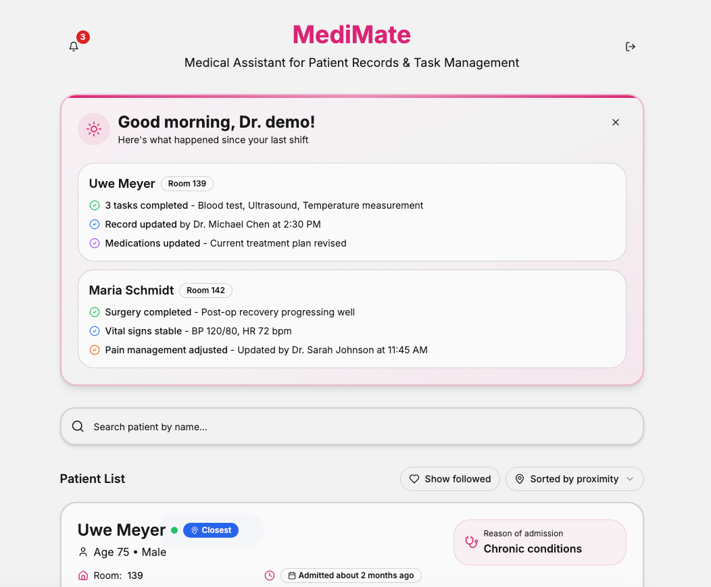

# MediMate

## Made during an AI & Health Hackathon in Stockholm (and made it to THIRD PLACE 🥉)



MediMate is an AI-powered assistant designed to help healthcare professionals and patients manage medical notes and patient data efficiently. Built with modern web technologies, it offers a fast and responsive user experience.

## Features

-   **Patient Management**: View and manage patient records.
-   **Medical Notes**: Process and store medical notes.
-   **Modern UI**: Built with Shadcn UI and Tailwind CSS for a sleek look.
-   **Supabase Integration**: Uses Supabase for backend and real-time data.

## Tech Stack

This project is built with:

-   [Vite](https://vitejs.dev/) - Frontend Tooling
-   [React](https://reactjs.org/) - UI Library
-   [TypeScript](https://www.typescriptlang.org/) - Static Type Checking
-   [shadcn-ui](https://ui.shadcn.com/) - UI Component Library
-   [Tailwind CSS](https://tailwindcss.com/) - Utility-first CSS Framework
-   [Supabase](https://supabase.com/) - Open Source Firebase Alternative

## Setup

Follow these steps to get the project running locally.

### Prerequisites

-   Node.js (v18 or higher recommended)
-   npm or yarn or pnpm

### Installation

1.  **Clone the repository**

    ```sh
    git clone https://github.com/LuiAr/medimate-assistant
    cd medimate-assistant
    ```

2.  **Install dependencies**

    ```sh
    npm install
    # or
    yarn install
    # or
    pnpm install
    ```

3.  **Environment Setup**

    Create a `.env` file in the root directory and add your Supabase credentials. You can copy the `.env.example` if it exists (currently not present, ensure you have your own Supabase project set up).

    ```env
    VITE_SUPABASE_URL=your_supabase_url
    VITE_SUPABASE_ANON_KEY=your_supabase_anon_key
    ```

4.  **Start the development server**

    ```sh
    npm run dev
    ```

    The app will be available at `http://localhost:5173`.


## License

This project is licensed under the MIT License - see the [LICENSE](LICENSE) file for details.
